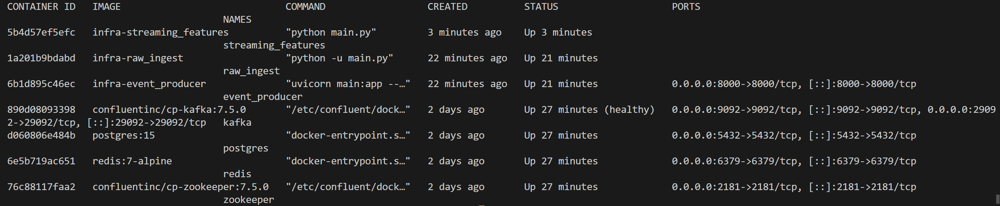
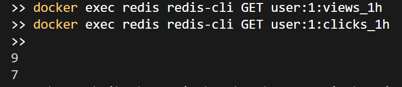

## Local development notes

### Host vs Docker networking

This project runs across two environments:
- Your Windows host terminal.
- The Docker Compose network.

Use different addresses depending on where the command runs:

| Where the command runs | Postgres | Redis | Notes |
|---|---|---|---|
| Windows host | `localhost:5433` | `localhost:6379` | Use published ports from `docker-compose.yml`. |
| Docker container | `postgres:5432` | `redis:6379` | Use Compose service names and internal ports. |

### Important rule

- `localhost` inside a container means **that same container**, not another service.
- Containers in Docker Compose should talk to each other using service names like `postgres` and `redis`.

### Feast workflow

For `/predict` to work, features must already exist in the online store.
Recommended order:

1. Start the stack.
2. Verify Feast config for the environment you are using.
3. Materialize features into Redis.
4. Call the prediction API.

### Materialization commands

If running Feast from the host:
```powershell
cd feature_store
feast materialize-incremental 2026-03-10T11:30:00

### API Testing
```Invoke-RestMethod `
  -Uri "http://localhost:8001/predict" `
  -Method Post `
  -ContentType "application/json" `
  -Body '{"user_id":1,"item_id":1}'

### Debugging scripts:
1. Running services
```docker compose -f infra/docker-compose.yml ps

2. Service logs
```docker logs model_service --tail 100

3. FEAST verification inside container
```docker exec model_service sh -c "cat /app/feature_store/feature_store.yaml"

 